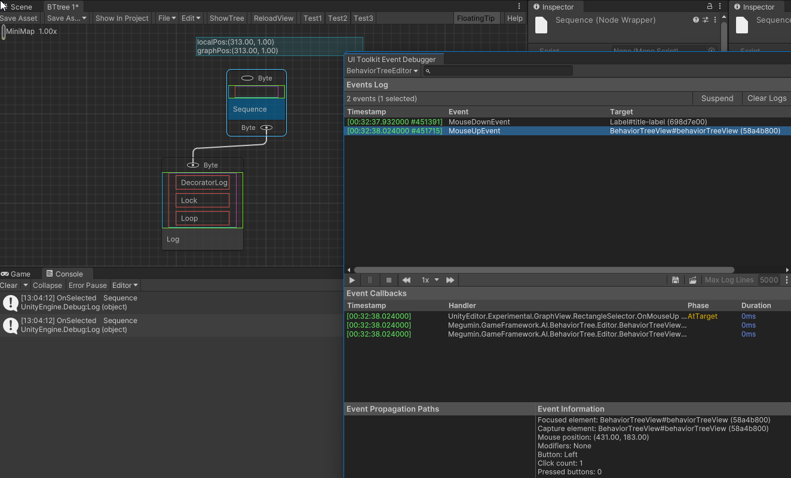
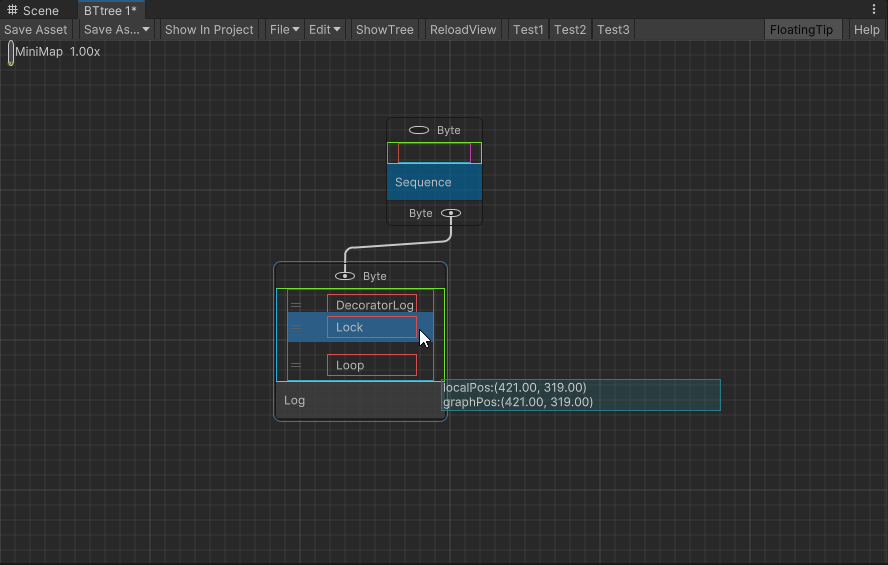

# GraphView

GraphView中的所有元素，都从GraphElement继承。GraphElement实现了很多默认功能。如果要自定义在GraphView中使用的控件，建议直接从GraphElement继承。  
GraphView自身从VisualElement继承。

建议：在你使用GraphView之前，一定要先学习DOM事件流。1个小时的扫盲学习会在后面为你节省至少10个小时的时间。

## DOM事件流

- 架构中事件按照既定流程处理事件[Unity - Manual: Handle events](https://docs.unity.cn/Documentation/Manual/UIE-Events-Handling.html)
- 在用户代码中，处理完自己的逻辑后，停止事件传播和防止其默认行为是常态，用于防止多个层级的回调函数同时被触发。  

## GraphView 保存布局
给viewDataKey赋值，GraphView.UpdatePersistedViewTransform() 触发SaveViewData()。默认支持保存布局。

## GraphElement 选中

通常OnSelected被执行2次。

- 第一次由GraphElement的ClickSelector m_ClickSelector 执行。在GraphElement的Capabilities capabilities含有Capabilities.Selectable枚举项时添加ClickSelector 。
  - 使用MouseDownEvent。注册在DOM事件流的冒泡阶段。
  - ClickSelector 额外检测了是否有子GraphElement元素也被被命中,参加ClickSelector.WasSelectableDescendantHitByMouse。如果含有可选择的子，那么当前元素不会执行被选择逻辑。也就是说，整个树中每次只能有一个GraphElement被选择。
- 第二次由RectangleSelector 执行。通常添加在GraphView中。
  - 使用MouseUpEvent。注册在DOM事件流的冒泡阶段。
  - 会收集矩形区域内所有可选择的GraphElement。然后依次执行AddToSelectionNoUndoRecord。顺序由GraphView中hierarchy控制，可以简单理解为从父到子。
  - RectangleSelector 表现为可以框选，也可以点选。点选时本质是矩形区域非常小。所以点选是会同时选中父元素可子元素。

## GraphElement 拖拽

由SelectionDragger实现，通常注册到GraphView中。

- 使用MouseDownEvent，MouseMoveEvent，MouseUpEvent，KeyDownEvent，MouseCaptureOutEvent。注册在DOM事件流的冒泡阶段。
- GraphElement 能否被拖拽由Capabilities.Movable枚举项控制。也就是说，GraphElement 仅设置自己能否被拖拽，实际拖拽控制，事件触发在GraphView这一个层级中。
-  假如的GraphElement 内部也需要执行拖拽逻辑，如ListView重排序。那么需要在ListView层级，注册MouseDownEvent，MouseMoveEvent，MouseUpEvent冒泡阶段，并阻止事件冒泡，向父级传播。否则会和GraphView中的拖拽逻辑互相干扰，表现不正确。
  

## Undo/Redo

使用内存ScriptObject实现，参考GraphViewUndoRedoSelection，注意hideFlags = HideFlags.HideAndDontSave。  
否则内存中的ScriptObject对象改动，会让Scene变成dirty状态。

## ContextualMenu

- 由合成的ContextualMenuPopulateEvent事件触发
- 触发在GraphView的上下文菜单
  - 注册ContextualMenuPopulateEvent回调 OnContextualMenu(ContextualMenuPopulateEvent evt)
  - MouseUpEvent/KeyUpEvent -> GraphView.ExecuteDefaultActionAtTarget -> EditorPanel.EditorContextualMenuManager.DisplayMenuIfEventMatches -> 合成事件ContextualMenuPopulateEvent -> 发送事件到GraphView。
  - 触发ContextualMenuPopulateEvent回调OnContextualMenu(ContextualMenuPopulateEvent evt) -> BuildContextualMenu
- 触发在Node的上下文菜单
  - Node添加ContextualMenuManipulator，内部注册MouseUpEvent/KeyUpEvent/ContextualMenuPopulateEvent。
  - MouseUpEvent/KeyUpEvent 调用 EditorPanel.EditorContextualMenuManager.DisplayMenu， 并停止事件传播。  
    并且防止其默认行为PreventDefault，因此GraphView.ExecuteDefaultActionAtTarget不会再被调用。
  - ContextualMenuManager.DisplayMenu 合成 ContextualMenuPopulateEvent，发送事件到Node。
  - Node的ContextualMenuManipulator的ContextualMenuPopulateEvent回调m_MenuBuilder被触发，执行Node.BuildContextualMenu。
  - ContextualMenuPopulateEvent事件继续冒泡，触发GraphView的ContextualMenuPopulateEvent回调 OnContextualMenu(ContextualMenuPopulateEvent evt)。

总结：

- 触发显示菜单时，由子到父，依次调用每个对象仅一次BuildContextualMenu。
- 自定义控件添加ContextualMenu，使用ContextualMenuManipulator即可。
- GraphView的BuildContextualMenu默认实现，仅对GraphView，Node，Group这个三个类型添加了菜单项，所以自定义控件ContextualMenu触发GraphView的BuildContextualMenu时，会什么都不发生。
- 你可以重写GraphView的BuildContextualMenu函数并根据evt.targe添加自己的菜单项。
- evt.targe是ContextualMenuManager.DisplayMenu发送事件的目标对象，也就是添加ContextualMenuManipulator的对象或者GraphView本身。

## 感想

通过对GraphView的学习和使用，又一次深刻认识到。软件编程中没有魔术，任何行为后面都有它对应的代码。  
阅读GraphView的源码对使用GraphView很有帮助。阅读源码是痛苦的，但仍比边猜边用要好得多。
