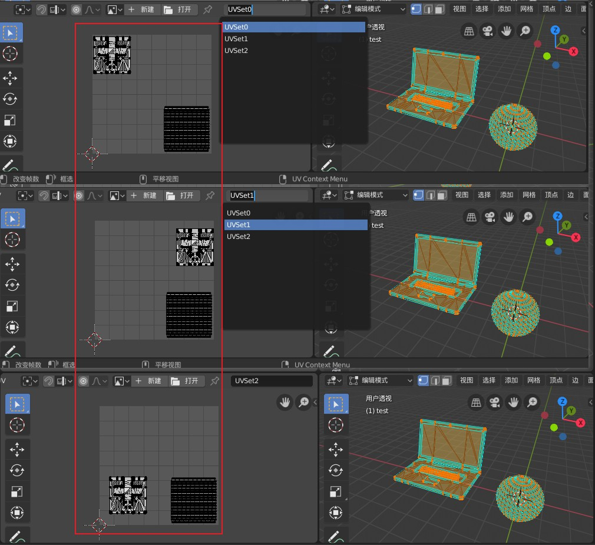
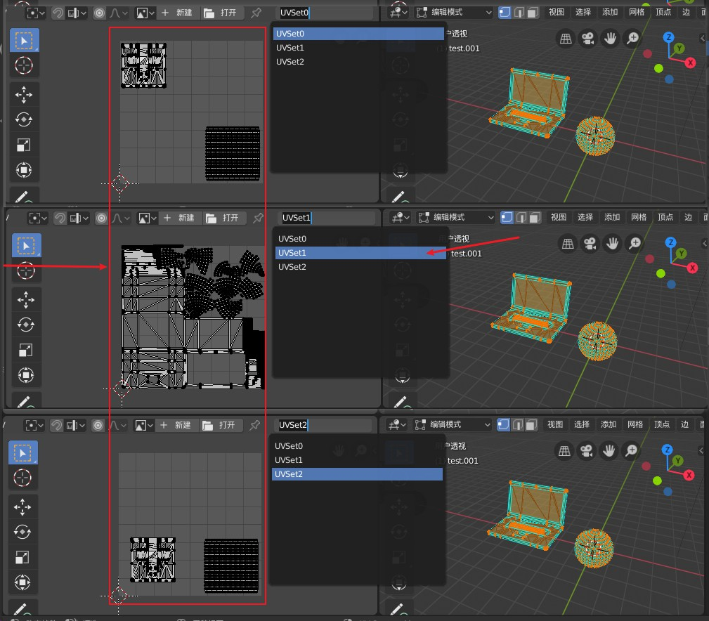

模型通常含有8个UV。在不同的软件中叫法略有不同。  

在unity中，分别叫[uv,uv2,uv3,……,uv7]。不存在uv1。  
在Mesh API中，也已经废弃uv1属性。  
在一些其他 API中，uv1属性 指的是第二通道的uv。 uv0属性指第一通道uv。

```csharp
namespace UnityEngine.Rendering
{
    // Control which UV channels are affected by the Texture Animation Module
    [Flags]
    public enum UVChannelFlags
    {
        UV0 = 1,
        UV1 = 2,
        UV2 = 4,
        UV3 = 8
    }
}

namespace UnityEditor
{
    [Flags]
    public enum VertexChannelCompressionFlags
    {
        None        = 0,
        Position    = 1 << 0,
        Normal      = 1 << 1,
        Tangent     = 1 << 2,
        Color       = 1 << 3,
        TexCoord0   = 1 << 4,
        TexCoord1   = 1 << 5,
        TexCoord2   = 1 << 6,
        TexCoord3   = 1 << 7,

        [System.Obsolete("Use Position instead (UnityUpgradable) -> Position", false)]
        kPosition   = 1 << 0,
        [System.Obsolete("Use Normal instead (UnityUpgradable) -> Normal", false)]
        kNormal     = 1 << 1,
        [System.Obsolete("Use Color instead (UnityUpgradable) -> Color", false)]
        kColor      = 1 << 2,
        [System.Obsolete("Use TexCoord0 instead (UnityUpgradable) -> TexCoord0", false)]
        kUV0        = 1 << 3,
        [System.Obsolete("Use TexCoord1 instead (UnityUpgradable) -> TexCoord1", false)]
        kUV1        = 1 << 4,
        [System.Obsolete("Use TexCoord2 instead (UnityUpgradable) -> TexCoord2", false)]
        kUV2        = 1 << 5,
        [System.Obsolete("Use TexCoord3 instead (UnityUpgradable) -> TexCoord3", false)]
        kUV3        = 1 << 6,
        [System.Obsolete("Use Tangent instead (UnityUpgradable) -> Tangent", false)]
        kTangent    = 1 << 7
    }
}
```

**MeshAPI中SetUV channel 参数为0-7。**

在blender中，通常默认名字为[UVMap，UVMap.001,UVMap.002,……,UVMap.007]。


# 测试uv2

## 1. 将一个含有3个UV的模型导入unity，原样导出后uv如图。  
三个通道uv位置不同。


## 2. 在unity中勾选Generate Lightmap UVs,导出模型。  


`发现引擎将模型的第二通道UV进行了覆盖，其他通道UV保持不变。`   
**`结论：使用多UV实现特殊功能时，尽量将第二通道UV预留。使用第三第四通道UV。`**