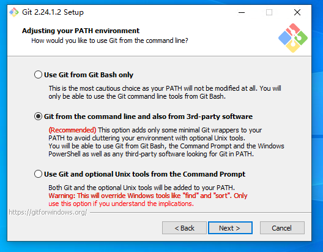
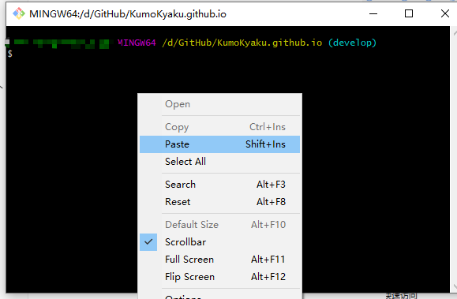
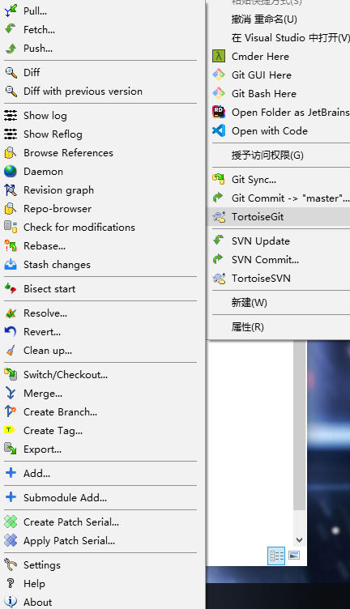

git作为当下最先进的版本管理工具，非常值得学习使用。

git是版本管理工具，类比于SVN。git-lfs 是git用于处理体积较大文件的一个插件。

# git的安装
1. 首先去官网[https://git-scm.com/downloads](https://git-scm.com/downloads)下载git最新版本。  

2. 然后去git-lfs官网[https://git-lfs.github.com](https://git-lfs.github.com/)下载lfs。  

<!-- more -->

1. 下载好无脑下一步安装即可。建议都安装在C盘。

   1. 安装会请求管理员权限。  
       
   
   2. 这里什么都不用改动，默认即可。  
       
   
   3. 这里同样默认。  
       
   
   4. 一路下一步。安装成功。  
       
   
   5. 安装git-lfs。  
       
   
   6. 安装完成。  
       
   
   7. 安装完成后右键菜单会出现新的选项。  
         
       按住shift然后鼠标右键，  
         
       输入 git --version,成功安装会显示版本号。注意是两个--命令输入错误会提示。如下图。
       
   
    1. 到这里git全部安装成功。
   

# git图形界面工具
git 安装完成之后，是命令行工具。非常不方便使用。所以我们使用图形界面工具来帮助我们使用git。

这里推荐tortoisegit(https://tortoisegit.org/download/) 和 sourcetree(https://www.sourcetreeapp.com/) 同时使用。

- tortoisegit 用于类似tortoisesvn 一样的右键菜单，和提供文件夹图标提示。
- sourcetree 有直观的树形图，和文件更改提示。

两个结合使用效果更加。

# tortoisegit 和 sourcetree 安装
tortoisegit 可以下载对应的中文语言包。sourcetree自带中文。  
同样，建议安装在C盘默认位置。

1. 安装tortoisegit  
     

   一路默认完成安装。  
   
   
   完成安装后点击finish，会弹出配置向导，可以此时配置，也可以直接关掉以后再配置。  
   
   
   中间配置git路径，如果都是默认安装会自动装的会自动找到，下一步即可，如果没有找到，手动选择。
   
   
   配置默认的提交时用的名字和邮箱。这个可以随时更改。也可以针对不同的库分别设置，此处也可跳过。
   
   
   后续直接完成即可。完成后右键菜单出现新的选项。如果想修改刚才的设置，可以进入Setting菜单中进行修改。
     

   （可选）安装中文语言包。
   
   下载中文语言包，注意简体中文和 是64位版本。
   
   
   
   
   
   一直下一步完成安装。
   
   在Setting中找到中文，确定即可。但通常我们使用英文版本。
   
   

2. 安装Sourcetree。

   要使用Sourcetree需要先注册一个账号。你可能需要翻墙才能成功注册。

   

   

   注册成功后选择bitbucket 登录你刚刚注册的账号。

   

   

   可能需要等一会

   

   

   如果一段时间没有翻译，就必须翻墙登录。

   

   登录成功后继续安装。（Mercurial 和 git svn一样也是一种版本管理工具。sourcetree同时支持git和Mercurial ，但是我们只使用git）

   

   注意：高级选项中的东西不如不懂就不要勾选。

   

   

   下一步会问你是否使用SSH密钥，这里选否。我们以后配置。不影响使用。（密钥的作用是可以让你不用账号密码登录，如果你使用密钥，需要妥善安全的保管好密钥文件）

   

   完成后，我们可以看到工作界面。

   

   之前的所有设置都可以在工具-选项中修改。

   

   

   

   

到这里我们完成所有所需软件的安装。

# git的使用。
我们先来简单使用一下git，然后再学习简单的工作提交流程。
我们在github找一个库(https://github.com/xirong/my-git)

你可打开这个网页，git库通常有两种地址可以使用

ssh地址，这个地址就是刚才询问我们是否配置密钥用的地址。我们没有配置密钥，所以我们使用另一种地址。

点击地址上面的Use Https,我们复制地址到soucetree。

对于Https地址，后面的.git 后缀可以省略。

如果sourcetree检测通过，克隆按钮会亮起。我们点击克隆。然后等待读条结束。

# git 设置大小写。
**git 默认是不区分大小写的。这在文件重命名时会引起严重错误。**
大小写设置是每个库单独设置的。

git config core.ignorecase false 

设置完后没有提示。你可以在.git隐藏文件夹中config文件中查看。也可以不用命令行直接在config文件中修改。

**false 是区分大小写，true 是不区分大小写。要注意。**

# git 进阶使用

1. 在本地创建一个模拟的服务器库。  
    为了练习git，我们在本地创建一个练习库。

    先创建一个新的空文件夹TempGitServer,名字不重要。位置哪里都可以，因为我这里只有C盘所以创建在C盘。

    

    点击查看，打开文件后缀名和隐藏文件夹。但是通常我们不要去修改隐藏的文件夹。

    

    在文件上右键选择

    

    在Make it bare上打勾确认。

    

    然后我们进入文件夹观察

    

    这样一个模拟的服务器的git库就建好了。

2. 然后我们克隆这个库。  

    

    点击克隆，我们将服务器库（模拟的）C:\TempGitServer  克隆到本地C:\Testgit下。

    

    我们打开文件加添加一个文件。我们可以看到一个.git的隐藏文件夹。不要去修改它。

    

    

    返回sourcetree等待刷新。我们看到sourcetree已经识别新文件。

    

    作者信息在这里修改。

    

    也可以针对这个库使用其他的作者信息。

    

    

    我们将新文件加入git。这个步骤在svn叫加入，在git中叫暂存。是将一个新文件（或者一个文件变化）添加到版本管理库的过程。

    

    暂存后提交按钮亮起

    

    你可以切换显示模式获得更直观的显示。

    填写提交信息提交。（你在上面修改了作者信息，要刷新下这个页面才会更新）

    

    提交完成，因为是崭新的库，会自动创建master分支。在团队工作中分支通常有程序员已经创建好了。

    

    

    然后我们将提交推送到服务器。因为是新库，服务器还没有任何东西，远程分支还没有。推送会自动创建。

    

    推送成功。

    

    修改文档增加新内容。等待sourcetree刷新。

    

    提交，然后推送到服务器。

    

    

    在一个新文件夹在克隆一份。尝试模拟多人合作。

    

    

    

3. 简单练习结束。如果想深入了解git。推荐到这里练习(http://learngitbranching.js.org/?plg_nld=1&plg_uin=1&plg_auth=1&plg_nld=1&plg_usr=1&plg_vkey=1&plg_dev=1)

# 重点 git 与 svn 区别

首先git本地含有版本库所有版本内容。svn只含有当前版本内容。也就是说。即使断网的情况下，git也可以回退到历史版本，而svn不行。

第二 git的提交是提交到本地库（也就是.git 隐藏文件夹中）。只有推送的时候才是向服务器传输内容。也就是说只要你不推送，你在本地所有操作都是安全的，不会破坏服务器内容。svn没有本地提交，是直接上传到服务器的，所以如果操作错误，提交了错误内容，会直接影响服务器。

svn 命令和 git 命令对比

svn：

git：

我们发现git会比svn多出几个命令。

| 操作命令 | git                  | svn  | 功能异同 |
| -------- | -------------------- | ---- | ---- |
| add /添加   | 将新文件加入版本管理 如果是已存在文件就会显示位暂存 | 将新文件加入版本管理 | 相同 |
| commit/提交 | 将文件变化 创建一个提交到本地 | 将文件变化 创建一个提交并推送到服务器 | svn 的commit 等于git的commit 加 push |
| push/推送 | 将本地的一个或多个提交 推送到服务器 |      |      |
| fetch/获取 | 将服务器的提交 下载到本地（.git 隐藏文件夹中）但是不修改本地库中当前的内容 |  | git 允许你先下载，然后在你觉得安全的时间在应用到你的本地工作文件夹中。 |
| pull/拉取 | 下载服务器内容并修改当前工作文件夹 | 下载服务器内容并修改当前工作文件夹 | 相同 |

# 版本管理与好的工作习惯
1. 不要在晚上下班前或深夜将工作内容推送到服务器。
   - 晚上精力下降，出错率比白天高非常多。
   - 将内容提交到本地，第二天早上上班推送到服务器
   - 如果你晚上推送，并且还出现了BUG……

2. 对于UNITY或UE等其他软件的工程类版本库。
   1. 开始工作前，拉去服务器的最新内容，检查项目是否正常。
   2. 开始工作。每隔一段时间进行一个小的提交保存进度（本地的）。
   3. 如果一项工作跨度时间很长，可以每天一次或两次拉去新内容到本地。
   4. 所有工作完成。打开的你引擎软件。检查项目是否正常。
   5. **关闭你的引擎软件，很多软件在关闭时会保存一些内容。很可能和你的工作内容有关。**
   6. 提交你的工作内容。只提交和你有关的东西。
   7. 如果是unity 不要忘记加入.meta文件。
   8. 在安全的时间推送到服务器。
3. 如果你会使用分支，尽量在分支上工作。

# git 工作流程
团队项目使用[2.3 Gitflow工作流](https://github.com/xirong/my-git/blob/master/git-workflow-tutorial.md#23-gitflow工作流)

如果你的项目是一个团队，你需要通读连接中的文章，并着重理解gitflow。**对于非程序员，你的团队通常允许你在develop分支直接工作，而不用管任何工作流程，就像你在svn trunk分支上工作一样。但是你仍然应该保持上面所说的好的工作习惯。**

通常团队中技术人员管理好各个分支。你也可以跟随sourcetree中的提示来完成。

进阶：

[2.5.4 在Gitflow工作流中使用Pull Request](https://github.com/xirong/my-git/blob/master/git-workflow-tutorial.md#254-在gitflow工作流中使用pull-request) 大型项目程序员必备技能。（其他工作者可选）

# git lfs 大文件管理（进阶内容，个人用户选读）

如果是团队项目，git管理者通常会配置大文件管理。如果你遇到下面的提示，通常是大文件设置不全面导致的。请停止提交，联系管理员进行大文件设置。

如果你是个人项目，不想用lfs，直接确定即可。

# git lfs原理

# 其他git 图形工具
https://git-scm.com/downloads/guis  
如果你不喜欢sourcetree，可以试试其他图形工具。
