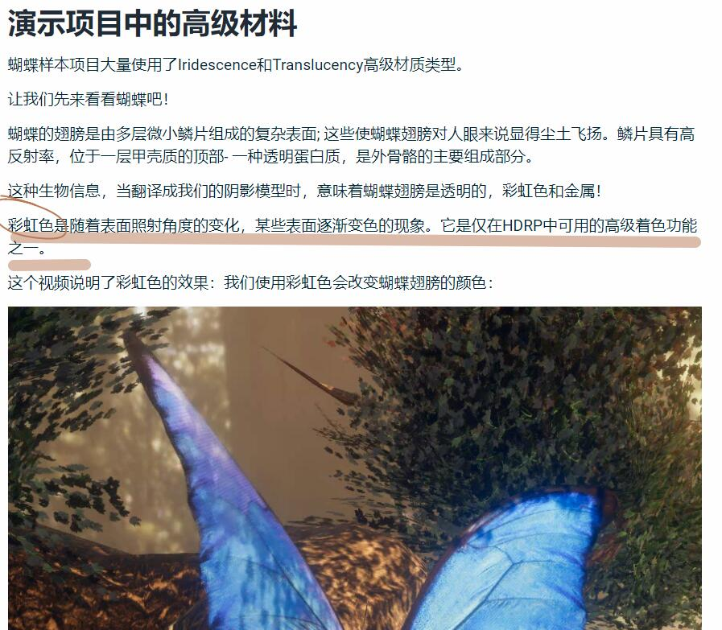
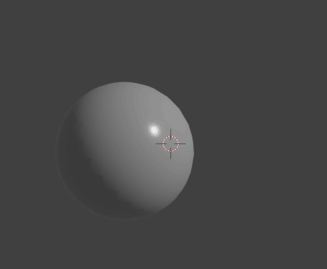
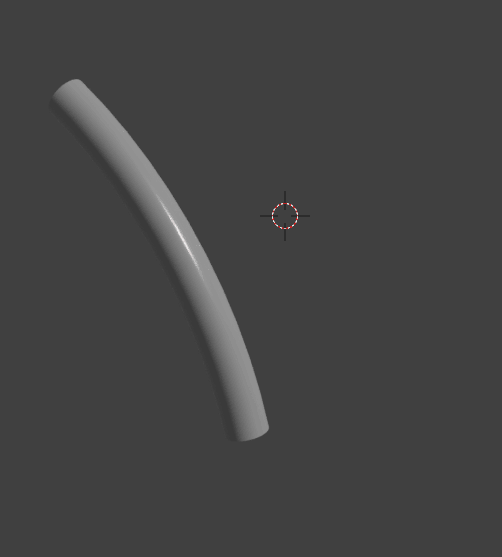
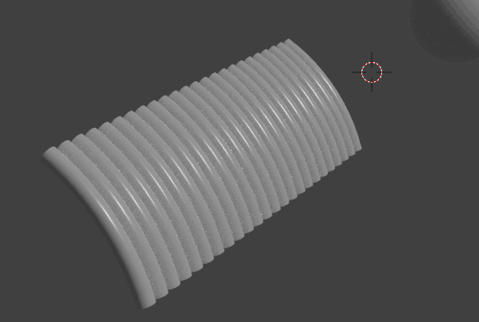
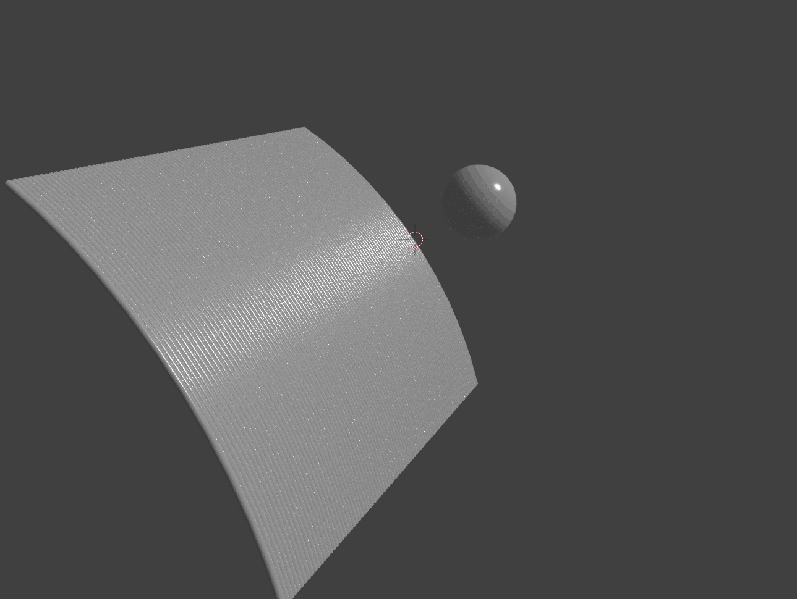
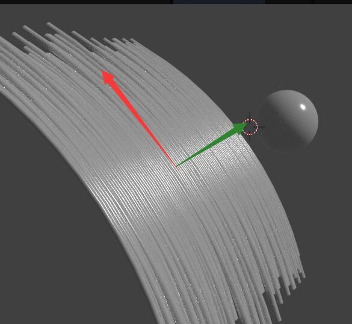
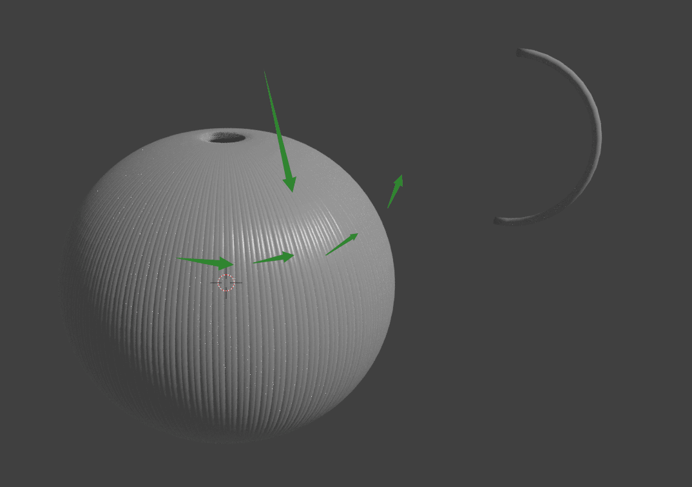
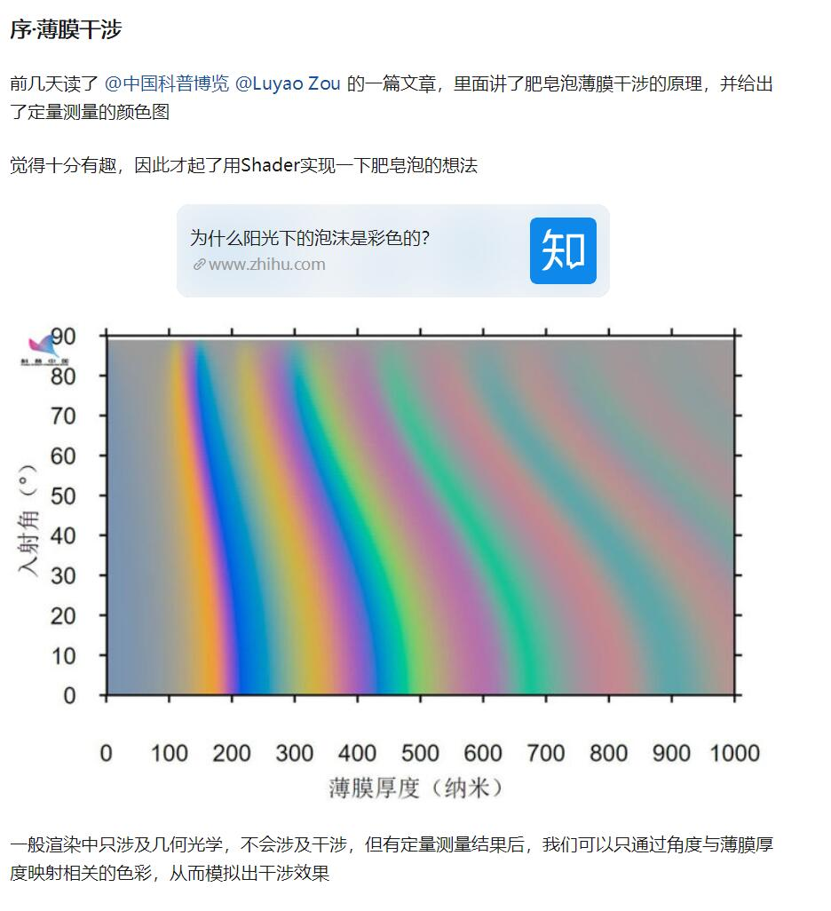

`云却` 2019/03/07 15:42:43  

这个指的是不是各向异性  

`叶月葵` 2019/03/07 15:43:58  
不是  

`叶月葵` 2019/03/07 15:44:00  
是衍射  

<!-- more -->

`叶月葵` 2019/03/07 15:44:06  
不过他怎么实现我不知道  

`叶月葵` 2019/03/07 15:44:28  
但是不管怎么说他的实现都应该归入各向异性  

`云却` 2019/03/07 15:45:23  
说白了各向异性 不就是 最终颜色 和 光线方向法线方向同时相关么？  

`云却` 2019/03/07 15:45:28  
难道我理解有误？  

`叶月葵` 2019/03/07 15:45:31  
不是  

`叶月葵` 2019/03/07 15:45:55  
各向异性实际上的原理是  
微表面结构具有明确的方向性的结构  

`叶月葵` 2019/03/07 15:46:30  
结果导致产生高光的地方看起来都有某个方向性的倾向，但是实际上每个点本身还是遵从本身的高光原理，只不过宏观上是各向异性  

`叶月葵` 2019/03/07 15:46:39  
所以跟色彩没关系，只跟高光有关  

`叶月葵` 2019/03/07 15:47:30  
比如你想想头发，抽象出来就是排一起的一排圆柱体，每一个圆柱体都符合本身正常的高光的原理，但是因为他是圆柱。所以圆柱本身的高光就一细长条  

`叶月葵` 2019/03/07 15:47:57  
结果你全排列起来的时候就看起来像是沿着某个方向延伸  

`叶月葵` 2019/03/07 15:49:15  
蝴蝶的色彩产生的关系是跟光的波长以及表面结构有关  

`云却` 2019/03/07 15:50:05  
嗯，可以了，我已经听不懂了，我去百度扫盲  

`叶月葵` 2019/03/07 15:50:08  
蝴蝶翅膀的鳞片是有某种规律的结构，进来的光经过反射之后，刚好每一束反射光的波长互相干涉，结果看起来七彩斑斓  

`叶月葵` 2019/03/07 15:50:58  
所以这个跟各向异性的原理无关，要按物理规律来产生这个颜色变化的话，光的波长，入射角度，反射之后的衍射这些都是有表可以查得  

`叶月葵` 2019/03/07 15:51:21  
之前知乎有一篇实现肥皂泡表面的彩色那个，跟这个原理差不多  

`云却` 2019/03/07 17:15:30  
求个示意图  

`云却` 2019/03/07 17:17:35   
各向异性实现的公式是固定的么？  

`叶月葵` 2019/03/07 17:31:36  
恩  

`云却` 2019/03/07 17:33:00  
脑子疼，完全搞不明白  

`叶月葵` 2019/03/07 17:33:44  

`叶月葵` 2019/03/07 17:33:47  
普通球体的高光  

`叶月葵` 2019/03/07 17:34:11  
然后计算的算法基本都一样不会变  

`叶月葵` 2019/03/07 17:34:24  
都是基于入射光，法线，视线有关  

`叶月葵` 2019/03/07 17:35:59    

`叶月葵` 2019/03/07 17:36:10  
这是一根弯曲的圆柱的高光  

`叶月葵` 2019/03/07 17:36:28  

`叶月葵` 2019/03/07 17:36:31  
来个一排  

`叶月葵` 2019/03/07 17:37:19

`叶月葵` 2019/03/07 17:37:21  
更细，更多  

`叶月葵` 2019/03/07 17:37:24  
各向异性出现了  

`叶月葵` 2019/03/07 17:37:31  
这就是各向异性的原理  

`叶月葵` 2019/03/07 17:37:57  
但是实际上，在物理上来说，每一个点其实原理都没变的
都跟这个球的高光的产生是一样的  

`叶月葵` 2019/03/07 17:38:18  
只不过一堆很细长的高光拼在一起让你看起来像是高光沿着某个方向展开  

`叶月葵` 2019/03/07 17:38:27  
而现在的各向异性算法也是一种拟合而已  

`叶月葵` 2019/03/07 17:38:57  
简单来说就是沿着切线和副切线的方向分别计算高光该多强  

`叶月葵` 2019/03/07 17:39:07  
这样来产生看起来沿着一个方向走的高光  

`云却` 2019/03/07 17:39:34  
我屡屡  

`叶月葵` 2019/03/07 17:39:57  
以及我到现在也还是照抄算法  

`叶月葵` 2019/03/07 17:40:11  
自己推倒感觉窒息，所以懒得推了，原理虽然懂。。。。。  

`叶月葵` 2019/03/07 17:41:45  

`云却` 2019/03/07 17:41:48  
实现这种各向异性必须一张法线贴图么  

`叶月葵` 2019/03/07 17:41:52  
是的  

`叶月葵` 2019/03/07 17:41:57  
用来控制偏移量的  

`叶月葵` 2019/03/07 17:42:19  
至于为啥头发那种，为啥不是均匀的，因为本身头发的弯曲就每一根都不同，粗细也有偏差  

`叶月葵` 2019/03/07 17:42:22  
位置偏差  

`叶月葵` 2019/03/07 17:42:41  
所以法线贴图模拟各向异性的时候就是用法线贴图的方向来控制这个偏移量  

`云却` 2019/03/07 17:43:22  
我还是不理解  

`叶月葵` 2019/03/07 17:43:38  

`叶月葵` 2019/03/07 17:43:44  
只能这两个方向阿  

`叶月葵` 2019/03/07 17:44:02  
均匀的表面，切线和副切线的影响是一样的  

`叶月葵` 2019/03/07 17:44:07  
所以圆球的高光是个点  

`云却` 2019/03/07 17:44:15  
这和普通高光有啥不同  

`叶月葵` 2019/03/07 17:45:00  
视觉上来说就是形状不同  

`叶月葵` 2019/03/07 17:45:10  
因为你看起来像是会沿着一个方向拉伸的高光  

`云却` 2019/03/07 17:45:28  
让我整理下思路  

`叶月葵` 2019/03/07 17:46:03  
算法的话真心照抄就行了，全天下就一个算法。。。。  

`云却` 2019/03/07 17:46:19  
OK  

纱代 2019/03/07 17:46:21  
普通的头发是一个mesh，不像这个是一堆圆柱，然后产生的高光就不是这样的，为了让普通的头发能产生这种效果就用到了各项异性<-这样理解对吗  

`叶月葵` 2019/03/07 17:46:29  
是的  

`叶月葵` 2019/03/07 17:46:44  
从我个人的角度来看各向异性也是一种特殊的微表面方程  

`叶月葵` 2019/03/07 17:46:48  
只不过他不需要积分。。。。。  

蠍 2019/03/07 17:47:17  
我也一直不理解  

`叶月葵` 2019/03/07 17:47:21  
原理的话就是这样了，一堆圆柱一样的玩意凑一起  

`叶月葵` 2019/03/07 17:47:28   
宏观上来看就是这样子了  

`云却` 2019/03/07 17:49:16  
也就是各向异性就是 高光 因 光线法线视线不同而变化，彩虹色 是 颜色 因 光线法线实现不同而变化 ，这样理解对么？  

`叶月葵` 2019/03/07 17:50:58  
彩虹色是因为反射光线的播互相干涉，改变了波长导致的  

`叶月葵` 2019/03/07 17:51:15  
波幅。。。。  

`云却` 2019/03/07 17:51:28  
不考虑原理  

`叶月葵` 2019/03/07 17:52:19  
不考虑原理的话，反正也和各向异性无关，因为各向异性只考虑入射光和出射光和视线的关系  

`叶月葵` 2019/03/07 17:52:36  
彩虹色要考虑的是rgb三个值因为反射过程发生了改变  

`叶月葵` 2019/03/07 17:52:59  
而这三个值的改变宏观上和反射角度没啥关系  

`叶月葵` 2019/03/07 17:53:21  
因为你人眼睛观不观察到都不影响他的变化，但是高光肯定有观察角度这个因素在参与  

`云却` 2019/03/07 17:54:00  
没懂  

`叶月葵` 2019/03/07 17:56:31  

`叶月葵` 2019/03/07 17:56:39  
再来一张图  

`叶月葵` 2019/03/07 17:57:31  
各向异性就只是高光而已  

`叶月葵` 2019/03/07 17:57:50  
或者叫高光的一种普遍形态，我们常见的高光才是特例  

`叶月葵` 2019/03/07 17:58:26   
所以影响他效果的因素就是  
入射角度，法线，观察者角度  

`叶月葵` 2019/03/07 17:58:37  
不会对颜色造成任何影响  

`叶月葵` 2019/03/07 17:59:18  
要是反射会变色，这就是某种对光的颜色的影响  
也就是说，影响因素是  
入射光颜色，材质表明因素  

`叶月葵` 2019/03/07 17:59:27  
这个就是常见的光反射和吸收  

`叶月葵` 2019/03/07 18:00:04  
要是蝴蝶翅膀那种  
那么入射光角度，材质表面因素，反射角度都有影响  

`叶月葵` 2019/03/07 18:02:37  
https://zhuanlan.zhihu.com/p/47575695  

`叶月葵` 2019/03/07 18:02:40  
严格来说就是这玩意  

`叶月葵` 2019/03/07 18:03:32  

成因不同，但是原理差不多  

`云却` 2019/03/07 18:03:40  
多谢，我消化消化  

`叶月葵` 2019/03/07 18:04:21  
薄膜干涉是因为光线穿过薄膜的表层和底层的时候发生的反射和折射，因为距离刚好跟光的波长能达成某种干涉  

`叶月葵` 2019/03/07 18:04:33  
蝴蝶表面是因为翅膀本身的结构，导致反射光产生干涉  

`叶月葵` 2019/03/07 18:04:45  
成因不一样但是结果都是光干涉  

`叶月葵` 2019/03/07 18:04:59  
那毫无疑问跟入射角度，材质表面有关  